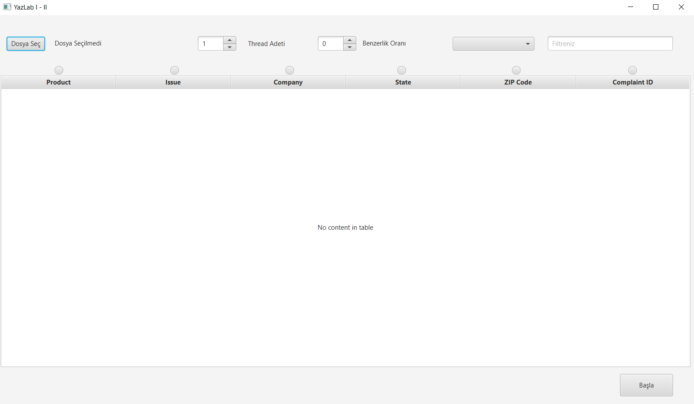
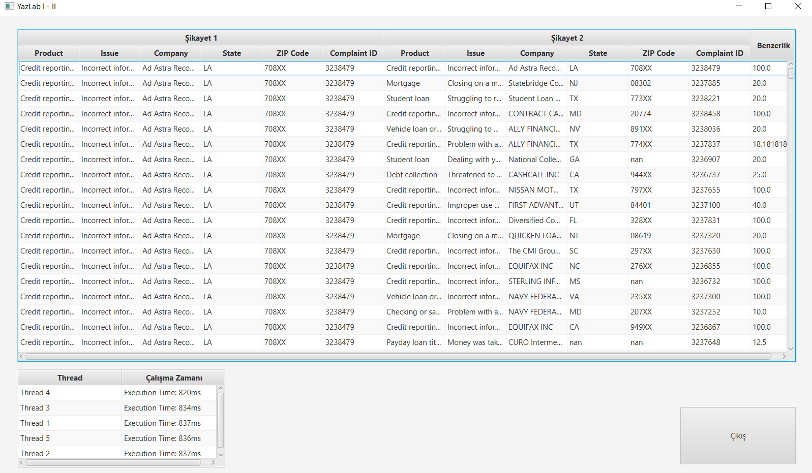

# JAVA Multithreading with JAVAFX

## What Is This App
This JAVA application reads large amount of complaint data from the given csv files 
and compares them on how many words do they have in common. The user has a lot of 
control over what complaints would they like to compare. They compare between
complaints that have a specific word, or can only get the comparisons that exceeds
given threshold and many more. They also can select how many threads they want to 
use.

## Used Tools
GUI part was built with SceneBuilder and the rest is pure JAVA.

## Images

